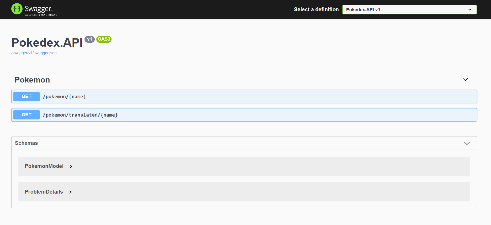

<div align="center">
	
	<br>
    <br>
    <h1>Pokedex Web API</h1>
    <p>
		<b>Simple .NET 5 implementation of a service that provides pokemon information.</b>
	</p>
    <br>
</div>

This repo contains an example of a REST API implemented in .NET Core using clean architecture principles and containerized with Docker. The service was developed keeping a pokemon domain in mind, but the principles used can easily be applied to design .NET Core based web APIs for any domain. For simplicity, we're using [PokeAPI](https://pokeapi.co/) to retrive pokemon information instead of a custom database. 

**Tech Stack:** [.NET 5](https://docs.microsoft.com/en-us/aspnet/core/web-api/?view=aspnetcore-5.0), [Docker](https://docs.microsoft.com/en-us/aspnet/core/host-and-deploy/docker/?view=aspnetcore-5.0), [Refit](https://github.com/reactiveui/refit), [AutoMapper](https://github.com/AutoMapper/AutoMapper), [Moq](https://github.com/Moq/moq4/wiki/Quickstart)

## Prerequisites

To run the app locally, you'd need to have **either** of the following installed on your machine:

1. [Docker Desktop](https://docs.docker.com/desktop/#download-and-install) - can build a docker image and spin up a container running the app locally. 
2. [.NET 5 SDK](https://dotnet.microsoft.com/download/dotnet/5.0) - can use the dotnet CLI or visual studio to build and run the app.

## Running Locally

We first need to get a local copy of this repository either by cloning or downloading the zip files.

If you want to run the app without using command line, you can open the `Pokedex.sln` file and directly run in Visual Studio.

Once you have a localy copy, open up your terminal/command prompt at the **root** of this repo and navigate to the `Pokedex` solution folder.

### Dotnet CLI

The following commands will launch the app on http://localhost:5000

```bash
> cd Pokedex.API
> dotnet run
```

### Docker

The following commands will build the image and run the app in a docker container.

```bash
> docker build -t pokedex-api .
> docker run -it --rm -p 5000:80 pokedex-api
```

This will run on: http://localhost:5000

You can now test the endpoints using any HTTP client tool like cURL, Postman, httpie etc.

Example using [httpie](https://httpie.io/):

```bash
> http http://localhost:5000/pokemon/pikachu
> http http://localhost:5000/pokemon/translated/pikachu
```


## Endpoints

Once you run the app, you should be able access the public routes below:

Feature | Type | Route | Access
------------ | ------------- | ------------- | -------------
Get Pokemon Details | GET | http://localhost:5000/pokemon/:name_or_id | Public
Get Pokemon with translated description | GET | http://localhost:5000/pokemon/translated/:name_or_id | Public


**Example Response Model**:

```json
{
    "description": "Their electricity could build and cause lightning storms.",
    "habitat": "forest",
    "isLegendary": false,
    "name": "pikachu"
}
```

Swagger Documentation is configured, so more information on the API endpoints and responses can be accessed at: http://localhost:5000/swagger



